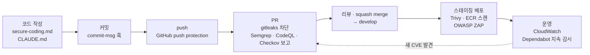

# DevSecOps의 Sec — 보안 도구 이론

## 1. DevSecOps란

**DevOps**는 개발(Dev)과 운영(Ops)을 하나의 흐름으로 묶어 자주, 자동으로 배포하는 방식이다. **DevSecOps**는 그 흐름 안에 보안(Sec)을 넣는다. 핵심은 두 가지다.

- **Shift Left** — 보안 점검을 개발 흐름의 왼쪽(앞쪽)으로 당긴다. 배포 직전에 한 번 몰아서 보는 대신, 코드를 쓰고 커밋하고 PR을 올리는 순간마다 본다. 취약점은 늦게 찾을수록 고치는 비용이 커진다. 코드 리뷰에서 찾으면 한 줄 수정이지만, 운영에서 찾으면 사고 대응이다.
- **자동화** — 사람이 매번 기억해서 돌리지 않아도 CI가 PR마다 돌린다. 사람은 **결과를 판단하는 일**에 집중한다.

> 도구는 사람을 대신하지 않는다. 도구는 "여기 이상해 보인다"고 알려 줄 뿐이고, 진짜 문제인지 판단하고 고치는 것은 사람이다. HacKHU-HP 1R의 목표도 도구를 켜는 것이 아니라 **결과를 판별하고 차단 기준을 정하는 것**이다.

## 2. HacKHU-HP 개발 흐름 속 보안 도구



| 시점 | 도구 | HacKHU-HP 라운드 |
|---|---|---|
| 코드 작성 | 시큐어 코딩 규칙, AI 도구 규칙(`CLAUDE.md`) | S1부터 |
| push | GitHub secret scanning · push protection | 1R (S2) |
| PR | gitleaks, Semgrep, CodeQL, Checkov | 1R (S2) |
| 상시 | Dependabot | 1R (S2) |
| 스테이징 배포 후 | Trivy, ECR 이미지 스캔, OWASP ZAP | 2R (S3) |
| Exploit 수정 후 | 보안 회귀 테스트 | 3R (S4) |

## 3. 용어

| 용어 | 뜻 |
|---|---|
| **True Positive (정탐)** | 도구가 경고했고 실제로 취약하다 |
| **False Positive (오탐)** | 도구가 경고했지만 실제로는 안전하다 |
| **False Negative (미탐)** | 실제로 취약한데 도구가 경고하지 않았다 — 가장 위험하다. 아무도 모른다 |
| **SARIF** | 정적 분석 결과를 담는 표준 JSON 형식. GitHub Code scanning 탭이 이것을 읽는다 |
| **CVE** | 공개된 취약점에 붙는 고유 번호 (예: CVE-2021-44228, Log4Shell) |
| **CWE** | 취약점의 **유형** 분류 (예: CWE-89 SQL 인젝션). secure-coding.md 괄호 안의 번호 |
| **OWASP Top 10** | 웹 애플리케이션에서 가장 흔하고 위험한 취약점 10가지 목록 |

## 4. 도구별 설명

### 4.1 SAST — 정적 애플리케이션 보안 테스트

**실행하지 않고 소스 코드를 읽어서** 취약한 패턴을 찾는다.

| | Semgrep | CodeQL |
|---|---|---|
| 방식 | 코드 **패턴** 매칭. 규칙이 코드처럼 생겨서 읽고 쓰기 쉽다 | 코드를 데이터베이스로 바꾸고 **데이터 흐름**을 쿼리한다. "사용자 입력이 SQL 실행까지 흘러가는가"를 추적한다 |
| 속도 | 빠름 (초 단위) | 느림 (분 단위, 언어에 따라 빌드 필요) |
| 강점 | 규칙 추가·수정이 쉽다. 여러 파일·언어를 한 번에 | 함수를 여러 번 거쳐 흐르는 인젝션을 잡는다 |
| 약점 | 파일 간 흐름을 놓치기 쉽다 | 규칙을 직접 쓰기 어렵다 |

**잘 잡는 것**: SQL 인젝션(문자열 연결 쿼리), 위험한 함수 사용(`eval`, `shell=True`), 약한 해시(MD5), 하드코딩된 설정, 디버그 모드.

**못 잡는 것**: **비즈니스 로직과 인가.** "이 글을 수정하는 사람이 작성자인가"는 코드 패턴이 아니라 **요구사항**이라서 도구가 모른다.

**HacKHU-HP에서**
- PR·push·매주 월요일에 돈다. PR을 **막지 않고** 결과를 Security → Code scanning 탭에 올린다.
- 1R SAST 담당(양수환, 이나은): 백엔드 스택이 정해지면 Semgrep에 `p/java` 또는 `p/python` 규칙셋을, CodeQL에 해당 언어를 추가하고 경고를 판별한다.

### 4.2 SCA — 소프트웨어 구성 분석

**내가 쓴 코드가 아니라 가져다 쓴 라이브러리**의 알려진 취약점(CVE)을 찾는다. 잠금 파일(`package-lock.json`, `gradle.lockfile`, `poetry.lock`)의 버전을 CVE 데이터베이스와 비교한다.

- 현대 웹앱 코드의 대부분은 오픈소스 의존성이다. 내 코드가 완벽해도 라이브러리 하나 때문에 뚫린다 (예: Log4Shell).
- 어제 안전했던 버전이 오늘 CVE가 나오면 취약해진다. 그래서 **한 번이 아니라 계속** 봐야 한다.

**도구**
- **Dependabot** (GitHub 내장): 취약한 의존성을 알려 주고 업데이트 PR을 자동으로 만든다.
- **Trivy** (`trivy fs`): 로컬에서 같은 검사를 할 수 있다.

**HacKHU-HP에서**
- [dependabot.yml](https://github.com/khu-HacKHU/HacKHU-HP/blob/develop/.github/dependabot.yml)에 GitHub Actions와 루트 npm이 설정돼 있다. 스택이 정해지면 frontend·backend ecosystem을 추가한다.
- 1R SCA·시크릿 담당(박지은, 김유석): ecosystem 추가, 취약 의존성 판별.
- 규칙: 잠금 파일을 커밋한다. Dependabot 보안 PR은 미루지 않는다. **AI가 제안한 패키지는 실제로 존재하는지 확인한다** (존재하지 않는 이름을 공격자가 먼저 등록해 두는 공격이 있다).

### 4.3 시크릿 스캔

코드·설정·**커밋 히스토리**에 들어간 API 키, 비밀번호, 토큰을 찾는다.

**왜 이것만 PR을 막는가**: 한 번 push된 시크릿은 되돌릴 수 없다. 커밋을 지우고 force push해도 이미 누군가의 clone, 포크, GitHub 캐시, 봇의 수집 기록에 남는다. 공개 저장소에 AWS 키가 올라가면 **몇 분 안에** 봇이 가져가서 채굴 서버를 띄운다.

**도구**
- **gitleaks**: 정규식과 엔트로피(무작위성)로 시크릿처럼 생긴 문자열을 찾는다. `git` 모드는 **히스토리 전체**를, `dir` 모드는 현재 파일만 본다.
- **GitHub secret scanning / push protection**: push 시점에 알려진 형식(AWS, GitHub 토큰 등)을 막는다.

**HacKHU-HP에서**
- gitleaks는 필수 검사 `Security / gitleaks`다. 걸리면 **머지할 수 없다.**
- 오탐은 [.gitleaks.toml](https://github.com/khu-HacKHU/HacKHU-HP/blob/develop/.gitleaks.toml) allowlist에 추가하고 PR 본문에 근거를 적는다.
- **시크릿이 유출됐을 때**: ① 즉시 키를 폐기·재발급 ② PL에게 알림 ③ 새 키는 GitHub Secrets에 ④ 커밋 제거 여부는 PL이 판단. 커밋을 지우는 것만으로는 해결되지 않는다.

### 4.4 IaC 스캔 — Infrastructure as Code

Terraform, Dockerfile, GitHub Actions 워크플로 같은 **인프라 설정 파일**의 잘못된 구성을 찾는다.

**잘 잡는 것**: 퍼블릭 S3 버킷, `0.0.0.0/0`에 열린 SSH, `"Action": "*"` IAM 정책, 암호화 안 된 DB, root로 도는 컨테이너, 워크플로의 과도한 권한.

**도구**: **Checkov** — 규칙마다 `CKV_AWS_20` 같은 ID가 있다. 억제할 때 이 ID를 쓴다.

**HacKHU-HP에서**
- `infra/`는 S2부터 작성한다. AWS는 **콘솔 직접 수정 금지, Terraform PR로만** 바꾼다. 그래야 Checkov가 모든 변경을 본다.
- `soft_fail`로 PR을 막지 않고 Code scanning에 올린다.
- 1R IaC 담당(서영채, 이소연): Checkov 경고 판별, `infra/` PR 리뷰 참여, 스킵 기준 문서화.

### 4.5 컨테이너 스캔

빌드된 **도커 이미지** 안의 OS 패키지와 라이브러리 취약점을 찾는다. 베이스 이미지(`python:3.8` 등)에 딸려 오는 패키지가 대부분이다.

**도구**: Trivy (`trivy image`), AWS ECR 푸시 시 스캔.
**HacKHU-HP에서**: 2R, 스테이징 배포 이후. 아직 미설정.

### 4.6 DAST — 동적 애플리케이션 보안 테스트

**실행 중인 앱에 실제 요청을 보내** 응답을 보고 취약점을 찾는다. 소스 코드를 보지 않는다(블랙박스).

**잘 잡는 것**: 빠진 보안 헤더(CSP, HSTS), 쿠키 속성(`HttpOnly`, `Secure`), 에러 페이지의 정보 노출, 일부 XSS·인젝션.
**도구**: OWASP ZAP. HP의 Juice Shop 실습에 맛보기가 있다.
**HacKHU-HP에서**: 2R (7주차), 스테이징 환경을 대상으로.

### 4.7 보안 회귀 테스트

S4에서 찾은 취약점을 고칠 때 **"이 공격이 다시 통하지 않는다"는 테스트 코드**를 같이 넣는다. 나중에 누가 코드를 바꿔서 취약점이 되살아나면 CI가 잡는다.

```text
예) 게시글 IDOR을 고친 PR에 넣는 테스트
- 사용자 A가 쓴 글을 사용자 B 토큰으로 PUT /posts/{id} → 403이어야 한다
```

**HacKHU-HP에서**: 3R (S4), 각 팀 테스트 코드.

## 5. 차단할 것인가, 보고만 할 것인가

| 도구 | 1R 설정 | 이유 |
|---|---|---|
| gitleaks | **차단** | 유출은 되돌릴 수 없다. 오탐 비용 < 유출 비용 |
| Semgrep, CodeQL, Checkov | 보고만 | 오탐이 섞여 있다. 처음부터 막으면 팀이 도구를 끄거나 무시 주석을 남발한다 |
| Dependabot | 보고 + 자동 PR | 새 CVE는 코드 변경과 무관하게 생긴다 |

1R 담당자가 결과를 판별해서 "이 규칙은 믿을 만하다"가 쌓이면 차단으로 바꾼다. 차단으로 바꾸는 방법은 `security.yml`의 `|| true`·`soft_fail`을 지우고 필수 검사에 추가하는 것이다.

## 6. 결과 판별

경고 하나마다 셋 중 하나로 분류하고 **근거를 남긴다.**

| 판정 | 처리 |
|---|---|
| **진짜 취약점** | 이슈 등록 (`security: [도구] 경고 요약`, `security` 라벨) → 담당 팀이 `security:` PR로 수정 → 재스캔으로 사라졌는지 확인 |
| **오탐** | 한 줄 단위로 좁게 억제하고 근거를 PR 본문에 적는다 |
| **위험 수용** | 지금 고치지 않는 이유와 **기한**을 이슈에 적는다. Code scanning에서 "Won't fix"로 닫는다 |

판별할 때 스스로 묻는다.

1. 이 값은 **사용자가 조작할 수 있는가?** (요청 파라미터, 헤더, 업로드 파일)
2. 조작하면 **어디까지 흘러가는가?** (DB 쿼리, 셸, 파일 경로, HTML 출력)
3. 중간에 **검증·이스케이프**가 있는가?
4. 이 코드는 **운영에 배포되는가?** (테스트 코드, 예시 파일이면 위험도가 다르다)

### 억제 방법

```text
# Semgrep — 해당 줄 끝에
password = get_from_vault()  # nosemgrep: 규칙ID — 근거

# Checkov — 해당 리소스 블록 안에
# checkov:skip=CKV_AWS_18: 근거

# gitleaks — .gitleaks.toml allowlist에 경로·정규식 추가 (PR 본문에 근거)
```

파일·규칙 전체를 끄는 것은 PL 승인이 필요하다. **이유 없이 무시 주석을 다는 것은 금지다.**

## 7. 도구가 못 잡는 것

OWASP Top 10 2021의 1위는 **A01 Broken Access Control(인가 실패)**이고, HacKHU-HP에서 가장 흔하게 나올 취약점도 이것이다.

| 취약점 | 예 | 도구가 못 잡는 이유 |
|---|---|---|
| IDOR (CWE-639) | 남의 글 `PUT /posts/42` | 코드 모양은 정상이다. "작성자만 수정 가능"이라는 요구사항을 도구는 모른다 |
| Mass Assignment (CWE-915) | 가입 요청에 `"role": "admin"` 끼워 넣기 | 요청을 DTO로 받는 건 정상 패턴이다 |
| 요청 횟수 제한 없음 (CWE-307) | 로그인 무차별 대입 | "없는 코드"는 패턴으로 찾을 수 없다 |
| 계정 존재 여부 노출 | "없는 아이디입니다" / "비밀번호가 틀렸습니다" | 에러 메시지의 의미는 도구가 판단하지 못한다 |

### 같은 게시판 API, 두 가지 취약점

```python
# ① SQL 인젝션 — Semgrep이 잡는다 (tainted-sql-string, formatted-sql-query)
@app.get("/api/posts")
def list_posts():
    sort = request.args.get("sort")
    return db.execute("SELECT * FROM posts ORDER BY " + sort)   # 사용자 입력이 쿼리 문자열로


# ② IDOR — 어떤 도구도 잡지 않는다
@app.put("/api/posts/<int:post_id>")
def update_post(post_id):
    user = current_user()                     # 로그인했는지만 본다
    db.execute("UPDATE posts SET content = ? WHERE id = ?",
               (request.json["content"], post_id))   # 파라미터 바인딩 — 패턴상 "안전"
```

①은 "사용자 입력이 쿼리 문자열에 붙는다"는 **모양**이 있다. ②는 모든 줄이 정상적인 모양이다. 빠진 것은 `post.author_id == user.id` 한 줄이고, **없는 코드는 패턴으로 찾을 수 없다.**

이것들은 **사람이** 찾는다.
- **코드 리뷰** — PR마다. 인증·파일 업로드·권한 관련 PR은 PL 최종 승인.
- **S4 Exploit** — 다른 팀이 [secure-coding.md](https://github.com/khu-HacKHU/HacKHU-HP/blob/develop/docs/security/secure-coding.md) 목록을 기준으로 직접 공격한다.
- **보안 회귀 테스트** — 한 번 찾은 인가 버그는 테스트로 고정해서 다시 생기지 않게 한다.

리뷰할 때 스스로 묻는다: **"이 API는 누가 호출할 수 있어야 하고, 코드는 그것을 확인하는가?"**

## 8. HacKHU-HP 보안 라운드 요약

| 스프린트 | 기간 | 보안 라운드 | 할 일 |
|---|---|---|---|
| S1 | 9/28 ~ 10/11 | 준비 | 오늘 수업, Juice Shop 실습 (HP `practice/`) |
| S2 | 10/12 ~ 11/1 | **1R** — SAST, SCA·시크릿, IaC | 담당자별 규칙 조정·경고 판별 |
| S3 | 11/2 ~ 11/15 | **2R** — 전 영역 + DAST | 스테이징 대상 ZAP, 컨테이너 스캔 |
| S4 | 11/16 ~ 11/29 | **3R** — Exploit과 수정 | 팀 간 공격, 수정 PR + 보안 회귀 테스트 |
| S5 | 11/30 ~ 12/13 | | 내부 테스트, 운영 배포 |

## 9. 생각해 볼 질문

1. gitleaks에 걸린 키를 다음 커밋에서 지웠다. 이제 안전한가? 왜?
2. Semgrep이 경고 50개를 냈다. 전부 `nosemgrep`으로 막으면 무엇이 문제인가?
3. 프론트엔드에서 관리자가 아니면 "삭제" 버튼을 숨겼다. 이것은 권한 검사인가?
4. Dependabot이 오늘 새 CVE를 알렸다. 우리 코드는 한 줄도 안 바뀌었다. 왜 생겼는가?
5. 우리 팀 기능(인증·게시판·갤러리)에서 도구가 **못 잡을** 취약점을 하나 떠올려 보자.
