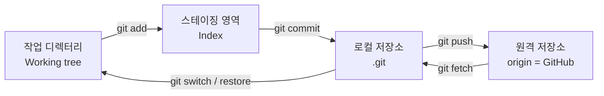
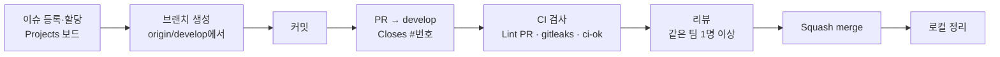

# Git 사용법과 HacKHU-HP 협업 방식

## 1. Git의 네 공간



| 공간 | 무엇 | 확인 명령 |
|---|---|---|
| 작업 디렉터리 | 에디터에서 보는 파일 | `git status` |
| 스테이징 영역 | 다음 커밋에 들어갈 변경 | `git diff --staged` |
| 로컬 저장소 | 내 PC의 커밋 기록 | `git log --oneline --graph` |
| 원격 저장소 | GitHub에 있는 커밋 기록 | `git log origin/develop` (fetch 후) |

- **`git fetch`는 원격의 변경을 받아 오기만** 하고 내 브랜치는 건드리지 않는다. `git pull`은 fetch + 합치기(merge 또는 rebase)다. 헷갈리면 fetch부터 한다.
- `origin/develop`은 **마지막으로 fetch한 시점**의 원격 develop이다. 최신이 아닐 수 있다.

## 2. 커밋과 브랜치

- **커밋**은 그 시점 프로젝트 전체의 스냅숏이다. 부모 커밋을 가리키며 사슬을 이룬다.
- **브랜치**는 커밋 하나를 가리키는 **이름표**다. 새 커밋을 만들면 이름표가 앞으로 움직인다. 브랜치를 만드는 것은 공짜다.
- **HEAD**는 "지금 내가 있는 곳"이다. 보통 브랜치를 가리킨다.

```text
          C---D   feat/12-notice-list  ← HEAD
         /
    A---B---E     develop
```

### 합치는 두 가지 방법

| | merge | rebase |
|---|---|---|
| 결과 | 두 줄기를 잇는 merge 커밋이 생긴다 | 내 커밋을 대상 브랜치 끝으로 옮겨 **다시 만든다** (해시가 바뀐다) |
| 히스토리 | 실제 일어난 그대로 | 한 줄로 깔끔 |
| 주의 | | **다른 사람이 쓰는 브랜치에는 하지 않는다.** 내 작업 브랜치에서만 |

HacKHU-HP에서 작업 브랜치를 최신 develop에 맞출 때는 `git rebase origin/develop`을 쓴다. PR은 squash merge로 합쳐지므로 작업 브랜치 안의 커밋 모양은 결국 하나로 뭉쳐진다.

## 3. HacKHU-HP 협업 흐름



- **이슈가 먼저다.** 업무 할당과 결정 사항은 GitHub 이슈에 공개적으로 남긴다. 단톡방에서 정한 것도 이슈에 옮긴다.
- **Projects 보드 하나**가 백로그의 단일 원본이다.
- **WIP 제한**: 한 사람이 동시에 `In Progress`로 두는 이슈는 **최대 2개**.

## 4. 브랜치 전략

```text
feat/12-notice-list ──PR──> develop
                               └── release/v0.1.0 ──PR──> main
fix/31-login-loop   ──PR──> develop
                    release/v0.1.0 <──PR── fix/42-release-blocker
```

| 브랜치 | 용도 | 누가 직접 push하나 |
|---|---|---|
| `main` | 운영에 배포된 코드 | 아무도 (PR만) |
| `develop` | 다음 출시를 준비하는 통합 브랜치. 기본 브랜치 | 아무도 (PR만) |
| `{type}/{이슈번호}-{slug}` | 작업 브랜치. 예: `feat/12-notice-list` | 작성자 |
| `release/vX.Y.Z` | 출시 준비. 새 기능 없이 출시를 막는 수정만 | PL |

- 작업 브랜치는 **분기 전에 `git fetch origin`을 하고 `origin/develop`에서 자른다.** 로컬 develop이 오래됐을 수 있기 때문이다.
- 이슈 번호는 `#` 없이 숫자만, slug는 영어 kebab-case.
- `main`에는 `release/vX.Y.Z`만 PR을 보낼 수 있다. CI가 출발 브랜치를 검사한다.
- **오래 사는 브랜치를 만들지 않는다.** 며칠 안에 머지가 안 되면 범위를 쪼갠다. 오래 살수록 충돌이 커진다.

## 5. 커밋 메시지

형식: `type: 한글 설명`

```text
feat: 공지 목록 조회 API 구현
fix: 로그인 후 무한 리다이렉트 수정
security: 게시글 수정 API에 작성자 검사 추가
```

| type | 용도 |
|---|---|
| `feat` | 새 기능 추가 |
| `fix` | 버그 수정 |
| `security` | 취약점 수정, 보안 설정 강화 (S4 Exploit 수정 포함) |
| `docs` | 문서만 변경 |
| `design` | UI·스타일 수정 (동작은 그대로) |
| `cicd` | 배포, CI/CD, 보안 스캔 워크플로 변경 |
| `refactor` | 동작 변경 없는 코드 구조 개선 |
| `test` | 테스트 추가·수정 |
| `chore` | 설정, 의존성, 그 외 유지보수 |
| `release` | 출시 PR (`release/vX.Y.Z → main`) 전용 |

- **scope를 쓰지 않는다.** `feat(web): ...` ✗
- 제목은 **72자** 안에서. squash merge가 ` (#123)`을 덧붙인다.
- **제목에 이슈 번호를 넣지 않는다.** 연결은 브랜치명과 PR 본문이 한다.
- 본문이 필요하면 빈 줄 하나 띄우고 **왜** 바꿨는지 쓴다. 무엇을 바꿨는지는 diff가 보여 준다.

**검사하는 곳이 두 군데다.**
- 로컬 `commit-msg` 훅은 **편의**다. 설치 안 해도 막히지 않는다.
- **관문은 CI의 `Lint PR`**이다. squash merge에서 히스토리에 남는 것은 **PR 제목**이므로 그것을 검사한다.

## 6. PR 규칙

| 방향 | 머지 방식 | 이유 |
|---|---|---|
| 작업 브랜치 → `develop` | **Squash merge** | 작업 중 커밋("오타 수정" 등)을 하나로 뭉쳐 develop 히스토리를 PR 단위로 유지 |
| 수정 브랜치 → `release/vX.Y.Z` | Squash merge | |
| `release/vX.Y.Z` → `main` | **Merge commit** | 어느 버전이 언제 배포됐는지 남긴다 |
| `release/vX.Y.Z` → `develop` | Squash merge | release에만 들어간 수정을 되돌린다 |

**PR을 올릴 때**
- 본문에 `Closes #12` — 머지되면 이슈가 자동으로 닫힌다.
- 본인을 assignee로 (`gh pr create --assignee @me`).
- **작성자는 모든 변경을 본인이 설명할 수 있어야 한다.** AI가 만든 코드도 마찬가지다.
- 작게 올린다. 리뷰어가 30분 안에 읽을 수 있는 크기.

**머지 조건**
- 같은 팀원 1명 이상 승인.
- 코드 오너 경로(`infra/` → PM·인프라팀, `.github/` → PL)는 코드 오너 승인 ([CODEOWNERS](../../.github/CODEOWNERS)).
- 인증·파일 업로드·권한 관련 PR은 **PL 최종 승인**.
- 필수 검사 통과: `CI / ci-ok`, `Lint PR / pr-title`, `Security / gitleaks`.

## 7. 리뷰

**리뷰어**
- 코드가 아니라 **변경의 이유와 동작**부터 본다. PR 본문과 연결된 이슈를 먼저 읽는다.
- 보안 관점 체크: 이 API는 **누가** 호출할 수 있는가? 사용자 입력은 어디로 흘러가는가? ([secure-coding.md](https://github.com/khu-HacKHU/HacKHU-HP/blob/develop/docs/security/secure-coding.md))
- 코멘트에 강도를 붙인다: `[필수]` 고쳐야 머지 가능 / `[제안]` 고려해 볼 만함 / `[질문]` 이해가 안 됨.
- 사람이 아니라 코드를 말한다. "왜 이렇게 했어요?" 보다 "이 경우 X가 null이면 어떻게 되나요?"

**작성자**
- 모든 코멘트에 답한다. 고쳤으면 커밋 링크, 안 고치면 이유.
- 리뷰 반영은 **새 커밋으로** 올린다 (force push로 덮어쓰면 리뷰어가 무엇이 바뀌었는지 못 본다). 어차피 squash된다.

## 8. 금지 사항

- `main`·`develop`에 직접 push
- 다른 사람이 쓰는 브랜치에 rebase·force push. 내 작업 브랜치에서 rebase 후에는 `git push --force-with-lease`만 쓴다 (`--force` ✗)
- 시크릿·`.env` 커밋 — 커밋했다면 **지우는 것으로 끝나지 않는다.** 키 폐기·재발급 후 PL에게 알린다 ([10/6 이론 4.3](../01-security-tools/theory.md#43-시크릿-스캔))
- `git add .` 후 확인 없이 커밋 — `git status`와 `git diff --staged`를 먼저 본다

## 9. squash merge 후 로컬 정리

squash merge는 내 커밋들을 **새 커밋 하나**로 만들어 develop에 넣는다. 그래서 Git은 내 로컬 브랜치가 머지됐다는 것을 모른다.

```bash
git switch develop
git pull
git branch -d feat/12-notice-list   # "not fully merged" 에러가 난다
git branch -D feat/12-notice-list   # PR이 머지된 것을 GitHub에서 확인했다면 -D로 지운다
git fetch --prune                   # 원격에서 지워진 브랜치의 origin/* 이름표 정리
```

GitHub 저장소 설정에서 "머지 후 브랜치 자동 삭제"를 켜 두면 원격 브랜치는 자동으로 지워진다.
